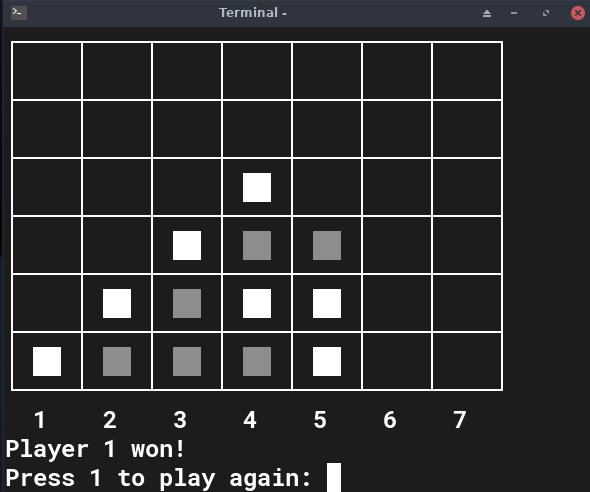
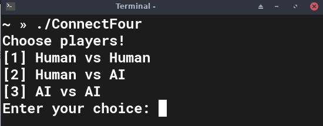

# connect-four-cli: The all time classic now for the terminal!

<p align="center">
  <br></br>
  
  <br></br>
</p>

## Getting Started
### Dependencies ###

- [CMake](https://cmake.org/) to simplify cross-platform compilation

### Preperations ###
1. Clone the repository
```bash
git clone https://github.com/emrecil/connect-four-cli
cd connect-four-cli
```

2. Create a build directory
```bash
mkdir build
cd build
```

3. Compile sources
```bash
cmake ..
make
```

## Usage

To start the game run the following command
```bash
./ConnectFour
```
A start menu will appear where you can choose the players
<p align="center">
  <br></br>
  
  <br></br>
</p>

After choosing an option the game will start. At the end you will be asked if you want to play again. Enter 1 to restart or any other number to exit the game.

## Information regarding the AI opponent
The AI is based on the negamax algorithm, which works by calculating a weight for every possible move until the game is over and tries to maximize the score of the current player.

Since it would take to long to compute every possible move a maximum depth has to be defined. I set the depth to 8 (you can change the depth by modifying the value of MAX_DEPTH in negamax.h) since it hits a sweet spot between quick and hard to play against. 

The speed can be further improved using alpha beta pruning and transposition tables which are both not yet implemented. Additional information on Negamax can be found on [Wikipedia](https://en.wikipedia.org/wiki/Negamax).
